# Product Roadmap: Meetings Memory | Cloudflare-Based Meeting Transcription & Diarization Tool

## 1. Product Vision & Goals

**Primary Goal**: Provide an automated, high-accuracy transcription service for meetings, coupled with robust speaker diarization to identify who said what.

**Key Objectives**:

1. Achieve near-human-level transcription quality leveraging **Whisper large** or **WhisperX**.
2. Provide accurate speaker labeling using **Pyannote (through WhisperX or as standalone)** or a fallback diarization solution.
3. Implement fully on **Cloudflare's serverless stack** (Workers (Python Beta), R2, D1, possibly with GPU)
4. Advanced text processing (clean-up, punctuation) via an LLM (e.g., Llama) hosted on Workers AI
5. Keep the user flow frictionless: user uploads meeting file -> final transcript (with speakers) is returned automatically.

## 2. Scope & Requirements

### 2.1. Input & Processing

* **Source Files**: MP4 or audio-only (e.g. WAV/MP3).
* **Data Ingestion**: Upload directly to R2 via Wrangler or a Worker endpoint (REST API)
* **Audio Extraction**: If MP4 is uploaded, extract audio in Worker using FFmpeg WebAssembly or a Python Worker runtime (if permitted).

**Transcription**:

* **Whisper** or **WhisperX** on Cloudflare.
  * If **WhisperX** is used, test running in Workers AI with Beta Python Workers environment (if GPU is available)

**Speaker Diarization**:

* **WhisperX** is the ideal solution, as it performs both speech and diarization automatically
* **Separate Whisper + Pyannote** is second best (requires GPU for best performance, potentially CPU fallback).
* If GPU or Beta Python environment is unavailable/unreliable (if Pytorch can't run correctly), fallback to a simpler approach:
  * Partial Pyannote pipeline (like VAD + embedding)
  * Use of LLMs for intelligent context reconstruction and assistance in diarization (correct logical errors and assign missing speakers)

**LLM Post-processing**:

* **Llama** (7B-13B) or any open-source model on Workers AI to improve punctuation, fix minor ASR errors, handle partial diarization if needed.

### 2.2. Output & Data Storage

**Transcript Format**:

* Detailed diarization (segment-level or word-level with speaker labels).
* Potential Word timings (if WhisperX is used).
* **R2**: Store the entire transcript file (TXT/SRT) for easy download or backup.

**APIs**:

* **Upload**: Allows user to push file or triggers an event from R2.
* **Results**: Retrieve final diarized transcript.

### 2.3. Implementation Constraints & Considerations

* **Cloudflare Worker Timeouts**:
  * For large files, chunk the audio to avoid timeouts.
* **GPU Usage**:
  * Pyannote & full Whisper large typically require GPU for real-time or near-real-time speeds.
  * If GPU is not consistently available in Workers Beta, the pipeline must handle CPU fallback, albeit slower.
* **Python Workers**:
  * Beta feature. Evaluate whether dependencies can be installed (especially PyTorch) for Pyannote & WhisperX.
  * Potential memory constraints or cold starts to be considered.

---

## 3. Roadmap Phases & Milestones

### Phase 1: Core Pipeline Proof-of-Concept

1. **Set Up Project Repos & Wrangler**
* Create or configure the GitHub repo with a Cloudflare Worker template.
* Define environment in wrangler.toml (R2, D1, AI)

2. **Basic Transcription with Whisper**
* Deploy a Cloudflare Worker that:
  * Takes a short audio file from R2 (or as direct upload).
  * Calls **Workers AI** with the built-in Whisper model (@cf/openai/whisper-large-v3-turbo).
  * Returns raw transcript.

**Success Criteria**: Transcribe a 1–5 minute audio snippet with decent accuracy.

3. **Store Transcripts in R2**

Create a minimal JSON schema:

* meetings (id, status, transcript_text, created_at, updated_at)
* Speech and assigned speaker

(Optional) Provide an endpoint to retrieve the data.

**Target Duration**: ~1 week to get a stable POC with successful transcription & DB integration.

---

### Phase 2: Enhanced Diarization & Audio Handling

1. **Audio Extraction**
* Implement **FFmpeg WebAssembly** or a Python Worker to demux audio from MP4.
  * Store extracted audio in memory or R2 (if big).
      
2. **WhisperX Integration**

Evaluate running **WhisperX** in a Python Worker with GPU access (beta).

If feasible:
* Confirm the environment can install PyTorch, whisperx, etc.
* If not feasible (or too slow on CPU):
  * Remain with standard Whisper on Workers AI.
      
3. **Diarization with Pyannote**

If **WhisperX** is integrated, it automatically uses Pyannote for diarization (requires setting environment variables & installing pyannote).

* Alternatively, run Pyannote alone in the Worker if we can.
* If GPU is not readily available, test CPU-based diarization performance on short test clips.
* If speed is unsatisfactory, fallback to simpler pipeline + LLM context correction.
    
4. **Segmented Storage**
* Create JSON with schema of speech analyzed
* Transcripts (id, meeting_id, speaker_label, start_time, end_time, text_segment)

**Target Duration**: ~3-4 weeks of R&D to handle complexities of Python environment, GPU, and integration of Pyannote/WhisperX.

---

### Phase 3: LLM Post-Processing & Chunking

1. **LLM Integration**
* Use a Llama-based model on Workers AI to correct final transcripts.
* Ensure we chunk transcripts if they exceed token limits.
* Reassemble corrected segments into a final text.

2. **Chunking for Long Audio**
* For multi-hour recordings, chunk the audio to smaller segments (e.g. 5 min).
* Transcribe them in parallel or sequentially to avoid Worker timeouts.
* Merge final transcript segments based on timestamps.

**Target Duration**: ~1 week to refine chunking approach and integrate LLM post-processing with robust error handling.

---

## 4. Detailed Deliverables

1. **Code Repository**:
* Contains Worker scripts (uploadWorker.js / processingWorker.js or a single module Worker with multiple event handlers).
* Python Worker code, plus instructions for installing Pyannote, WhisperX.
    
2. **Documentation**:
* Setup guide: how to configure R2, D1, queue, GPU or CPU environment.
* Usage guide: how to run Wrangler commands, test endpoints locally, deploy to dev & prod.
    
3. **API Endpoints**:
* **POST /upload**: Accept file, store in R2.
* **GET /transcript/:meetingId**: Return final transcript JSON or text.

---

## 5. Risks & Mitigations

1. **WhisperX / Pyannote GPU Dependency**
* **Risk**: GPU might not be consistently available or environment might be unstable in beta.
* **Mitigation**: Have a fallback diarization approach or run partial steps on CPU, with reduced performance.

2. **WhisperX Complexity**
* **Risk**: Installing large libraries (PyTorch, etc.) in the Python Worker might exceed memory or time constraints.
* **Mitigation**: Evaluate smaller or quantized versions of models, or fallback to standard Whisper on Workers AI.

---

## 6. Key Success Metrics

1. **Accuracy**:
* Word Error Rate (WER) for transcriptions vs. reference data.
* Speaker attribution accuracy for diarization (DER – Diarization Error Rate).

2. **Performance**:
* Average processing time per hour of audio.
* Time to get final transcript from upload to completion.
    
3. **Reliability**:
* Failure rate (due to Worker timeouts or model errors).
* Percentage of jobs that finish successfully on first try.

## Architecture Diagram

```mermaid
graph LR

%% Ingestion  
subgraph Ingestion  
   A([User uploads video/audio]) -->|HTTP PUT/POST| B([Worker: Upload Endpoint])  
   B -->|Store file| C([R2 Bucket])  
   C -->|Object Created event| D([Queue or direct Worker call])  
end

%% Processing  
subgraph Processing  
   D --> E([Extract Audio if needed])  
   E --> F([Transcribe with Whisper or WhisperX])  
   F --> G([Diarization<br/>Pyannote or Embeddings])  
   G --> H([LLM Post-processing<br/>LLaMA or similar])  
   H --> I([Final Transcript:<br/>Diarized & Corrected])  
end

%% Storage  
subgraph Storage  
   I --> K([R2<br/> Transcript File])  
   K --> L([API Endpoint<br/>for Transcript Access])  
   L --> M([End User / Client])  
end

%% Styling  
style A,B,C,D,E,F,G,H,I,J,K,L,M fill:#f9f9f9,stroke:#333,stroke-width:1px,rx:10,ry:10
```

