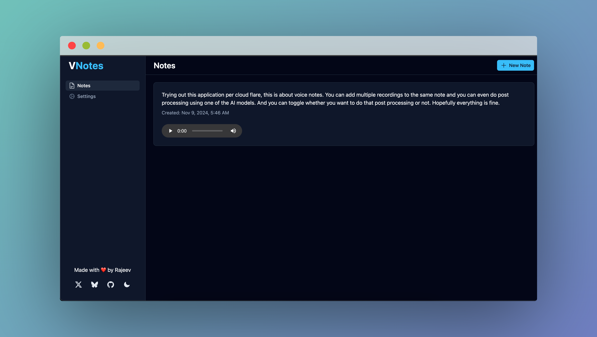

# VNotes

A serverless voice notes application built with Nuxt 3, Cloudflare Workers, Workers AI, D1 Database, and R2 Storage. This app allows users to record voice notes, transcribe them using AI, store them in a database, and manage them through a simple, intuitive interface.

Live demo: <https://vnotes.rajeevs.workers.dev>




## Features

- Record Voice Notes: Record audio directly from the app (supports multiple recordings per note).
- Speech-to-Text Transcription: Automatically transcribe recordings into text using AI models.
- Post-Processing: Optionally correct and refine transcriptions for better accuracy and clarity.
- Notes Display: View and manage saved notes with playback for each audio recording.
- Cloudflare Integration: Utilizes Cloudflare’s serverless environment (Workers, Workers AI, D1 Database, and R2 Storage) for scalability and low-latency performance.

## Technologies Used

- Nuxt 3: Modern Vue.js framework for building the frontend.
- Nuxt UI: For creating a good looking and professional frontend
- Cloudflare Workers: Serverless compute platform for handling backend operations.
- D1 Database: Cloudflare’s serverless SQL database for storing notes.
- R2 Storage: Cloudflare's object storage solution for storing audio files.
- Workers AI: Integration with Cloudflare Workers AI for transcription and post-processing.

## Setup Instructions

### Prerequisites

- Node.js (v18 or later): Required for development and building the project.
- Cloudflare Account: You'll need a Cloudflare account to configure Workers AI, D1, and R2 storage, and to deploy the project.
Wrangler CLI: The tool used for deploying Cloudflare Workers.

### Installation

Clone the repository and install dependencies:

```bash
pnpm install # or npm/yarn install
```

### Update the `wrangler.toml` file

Update the `wrangler.toml` file with the correct `DB_NAME`, `DB_ID` and `BUCKET_NAME`.

You can create the D1 database by running:

```bash
npx wrangler d1 create <DB_NAME>
```

And, create an R2 bucket by running:

```bash
npx wrangler r2 bucket create <BUCKET_NAME>
```

### Create the notes table

There is already a migration created in the projects root directory. Apply it to create the notes table.

```bash
npx wrangler d1 migrations apply <DB_NAME>
```

### Start the local development server

```bash
pnpm run dev # or npm/yarn run dev
```

The app will be available at <http://localhost:3000>.

## Deployment

To deploy the app to Cloudflare Workers (uses the Workers Module Format Syntax), run the following command:

```bash
pnpm run deploy # or nom/yarn run deploy
```

## How It Works

- Recording Notes: Users can record audio notes directly from the app. The audio file(s) is/are saved to R2 storage and a note entry is created in the D1 database.
- Transcription: After the audio is recorded, the transcription is automatically generated using an AI model (Whisper).
- Post-Processing: Users can enable optional post-processing to correct and refine the transcription using another AI model (Llama-3.1).
- Displaying Notes: All notes are displayed on the main page, where users can listen to the audio and view the transcription.


## Contributing

Contributions are welcome! If you find any issues or want to add new features, feel free to fork the repo, create a branch, and submit a pull request.

## License

This project is licensed under the MIT License - see the LICENSE file for details.
